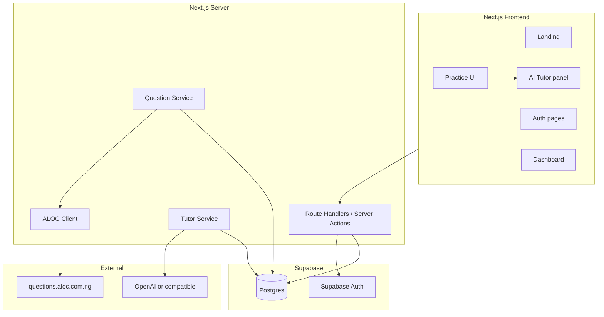
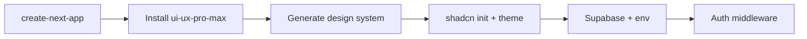

# Exam AI Tutor MVP — Implementation Plan

## Context

- **Workspace**: Only `[exam_ai_tutor_prd_markdown.md](exam_ai_tutor_prd_markdown.md)` exists today — full greenfield scaffold.
- **Stack**: Next.js (App Router) + Supabase (Auth, Postgres, RLS) + shadcn/ui + **ui-ux-pro-max** (project-local design system skill).
- **Beta scope**: UTME/JAMB only; subjects English, Mathematics, Biology, Chemistry, Physics, Government, Economics; **Practice Mode only** (Timed Mode deferred).
- **North star**: Student submits answer → sees feedback → asks “why?” → AI tutor explains with question context.

---

## Architecture



**Principles from PRD**

- Never expose `ALOC_ACCESS_TOKEN` or LLM keys to the browser.
- Cache/normalize ALOC payloads in Postgres before serving practice UI.
- Tutor only after answer submission in Practice Mode (no pre-answer spoilers).

---

## Project scaffold

| Area      | Choice                                                      |
| --------- | ----------------------------------------------------------- |
| Framework | Next.js 15+ App Router, TypeScript, `src/` layout           |
| UI        | shadcn/ui + Tailwind, mobile-first responsive               |
| Design    | **ui-ux-pro-max** skill — design system before page build   |
| Auth      | Supabase Auth (email/password); Google OAuth as fast-follow |
| DB        | Supabase migrations + RLS on all user-owned tables          |
| AI        | Vercel AI SDK (`ai` package) streaming from Route Handler   |
| Deploy    | Vercel + Supabase project                                   |

### Scaffold sequence (M1)



1. **create-next-app** — App Router, TS, Tailwind, `src/`
2. **Install ui-ux-pro-max** (project-local, commit to repo):

```bash
npx skills add https://github.com/nextlevelbuilder/ui-ux-pro-max-skill --skill ui-ux-pro-max -y
```

1. **Prerequisite:** Python 3.x for skill `search.py` (`python3 --version`)
2. **Generate design system** — EdTech / exam prep, mobile-first, trustworthy (not generic AI-gradient SaaS):

```bash
python3 .cursor/skills/ui-ux-pro-max/scripts/search.py \
  "education edtech exam prep student learning platform mobile-first" \
  --design-system --persist -p "ExamAITutor" -f markdown
```

Produces `design-system/MASTER.md` and optional `design-system/pages/{landing,dashboard,practice,tutor}.md`. Prefer **Accessible & Ethical** or **Soft UI Evolution** styles from skill output.

1. **shadcn init** — map MASTER tokens into CSS variables / `globals.css`
2. `**.cursor/rules/design-system.mdc` — agents read MASTER (+ page override) before UI work; shadcn components only; 375px mobile requirement
3. Supabase, migrations, middleware auth (rest of M1)

### Agent skills and MCP

| Tool              | Scope                               | Role                                                 |
| ----------------- | ----------------------------------- | ---------------------------------------------------- |
| **ui-ux-pro-max** | Project (`npx skills add`, no `-g`) | Design system, UX checklist, stack=shadcn guidelines |
| **shadcn**        | Global                              | Component CLI and composition rules                  |
| **Supabase MCP**  | Cursor                              | Schema, migrations, RLS — no Supabase skill          |
| **ALOC MCP**      | Cursor                              | Question API params                                  |

ui-ux-pro-max handles _what_ the UI should look like; shadcn handles _how_ to implement with components.

**Suggested directory layout**

```
cbt-ai/
├── .cursor/skills/ui-ux-pro-max/   # from npx skills add (path may vary; commit)
├── design-system/
│   ├── MASTER.md
│   └── pages/
├── .cursor/rules/design-system.mdc
├── src/
│   ├── app/
│   │   ├── (marketing)/page.tsx          # Landing
│   │   ├── (auth)/login, signup, reset
│   │   ├── (app)/dashboard, practice/[sessionId], history, settings
│   │   └── api/
│   │       ├── questions/sync/route.ts   # Admin/cron: prefetch
│   │       ├── sessions/route.ts
│   │       ├── tutor/route.ts            # Streaming chat
│   │       └── reports/route.ts
│   ├── components/                       # shadcn + domain components
│   ├── lib/
│   │   ├── supabase/{client,server,middleware}.ts
│   │   ├── aloc/{client,normalize,map-exam-subject}.ts
│   │   ├── tutor/{system-prompt,build-context}.ts
│   │   └── constants/{subjects,exams}.ts
│   └── types/
├── supabase/migrations/
└── .env.local                            # ALOC token, OpenAI key, Supabase keys
```

---

## Data model (Supabase)

Implement PRD entities from [Section 10](exam_ai_tutor_prd_markdown.md) with narrow-beta constraints.

### Tables

`**profiles**` (extends `auth.users`)

- `id`, `name`, `target_exam` (default `utme`), `selected_subjects` (text[]), `created_at`, `last_active_at`

`**questions**`

- `id` (uuid), `external_source` (`ALOC`), `external_question_id`, `exam_type`, `subject`, `year`, `question_text`, `options` (jsonb), `correct_answer`, `source_explanation`, `raw_payload` (jsonb), `is_disabled`, `local_override_answer`, `local_override_explanation`, timestamps
- Unique on `(external_source, external_question_id, subject)`

`**practice_sessions**`

- `id`, `user_id`, `exam_type`, `subject`, `year` (nullable), `mode` (`practice`), `total_questions`, `started_at`, `completed_at`, `score`, `accuracy`, `duration_seconds`

`**attempts**`

- `id`, `session_id`, `user_id`, `question_id`, `selected_answer`, `correct_answer`, `is_correct`, `time_spent_seconds`, `created_at`

`**tutor_conversations**`

- `id`, `user_id`, `session_id`, `question_id`, `messages` (jsonb array), timestamps

`**question_reports**`

- `id`, `user_id`, `question_id`, `subject`, `session_id`, `issue_type`, `message`, `status` (`open`/`resolved`), `forwarded_to_aloc`, `created_at`

`**ai_usage_logs**` (cost control)

- `user_id`, `session_id`, `question_id`, `tokens_in`, `tokens_out`, `created_at`

### RLS

- All user tables: `user_id = auth.uid()` for SELECT/INSERT/UPDATE.
- `questions`: readable by authenticated users; writable only via service role (sync job).
- Simple admin: `profiles.role = 'admin'` for report queue + question overrides.

---

## ALOC integration

**Base**: `https://questions.aloc.com.ng/api/v2/q?subject={subject}&type=utme&year={optional}`

**Headers**: `AccessToken: ALOC-...` (from [questions.aloc.com.ng](https://questions.aloc.com.ng) dashboard)

**Mapping layer** (`src/lib/aloc/map-exam-subject.ts`)

| UI label    | ALOC `subject` |
| ----------- | -------------- |
| English     | `english`      |
| Mathematics | `mathematics`  |
| Biology     | `biology`      |
| Chemistry   | `chemistry`    |
| Physics     | `physics`      |
| Government  | `government`   |
| Economics   | `economics`    |

Exam fixed to `type=utme` for beta.

**Question Service flow**

1. On session start: query local `questions` where `exam_type=utme`, `subject`, optional `year`, `is_disabled=false`, exclude IDs already in session.
2. If count < requested N: fetch from ALOC → normalize → upsert → retry.
3. Normalize ALOC JSON into stable shape (`question_text`, `options` A–D, `correct_answer`, `source_explanation`).
4. Dedupe within session by `external_question_id`.

**Prefetch strategy** (Milestone 1)

- Script or protected API route to sync ~50–100 questions per beta subject on deploy / cron.
- Reduces live-session dependency on ALOC rate limits (7k free calls).

**Report forwarding** (Milestone 5)

- Map internal issue types to ALOC POST `/api/r` types (1=question, 6=answer, 7=solution, etc.).
- Store locally first; forward async with user consent fields.

---

## Core user flows

### 1. Landing → Sign up → Onboarding

- Landing: promise + “Start Practicing” + “Try Sample Question” (1 public cached UTME Chemistry question, no auth).
- Signup: name, email, password (<60s).
- Onboarding (minimal): confirm UTME, pick subjects from 7 (multi-select), skip exam year for now.

### 2. Dashboard

- Continue practice (last incomplete session if any).
- Start new practice.
- Cards: recent score, weakest subject (by attempt accuracy), streak (days with ≥1 completed session), 3 recent missed questions.
- Copy tone per PRD (“You’re getting stronger in Chemistry…”).

### 3. Practice session (Practice Mode)

**Start form**: subject, optional year, count (10/20/40).

**Per question screen**

- Header: subject · UTME · year
- Options A–D, Submit (disabled after submit)
- Post-submit: Correct/Incorrect, correct answer, short explanation (`source_explanation` or local override)
- “Ask AI Tutor” opens side sheet (desktop) / bottom sheet (mobile)
- “Report issue” modal

**Grading**: server-side compare `selected_answer` to `correct_answer` (respect `local_override_answer`).

**Session end**: summary with score, time, AI-inferred weak concepts (see below), CTAs to review missed / start another.

### 4. AI Tutor

**Route**: `POST /api/tutor` — Vercel AI SDK streaming.

**Context payload** (PRD Section 9):

```json
{
  "exam_type": "utme",
  "subject": "chemistry",
  "year": "2010",
  "question_id": "...",
  "question": "...",
  "options": { "A": "...", "B": "..." },
  "correct_answer": "B",
  "student_answer": "C",
  "source_explanation": "...",
  "mode": "post_answer_explanation"
}
```

**System prompt rules**

- Step-by-step, simple English, encouraging tone.
- Do not invent exam facts; flag uncertainty if answer seems inconsistent.
- No JAMB/WAEC official affiliation.
- Quick-action buttons seed first user message: “Explain simply”, “Why was my answer wrong?”, “Similar question”, “What topic is this?”

**Persistence**: append messages to `tutor_conversations` per question+session.

**Cost controls (beta)**

- e.g. 30 tutor messages/user/day (configurable env).
- Log tokens to `ai_usage_logs`.
- Optional: cache generic explanations per `question_id` when no student-specific context needed.

### 5. Progress & review

- **History**: list sessions with score, subject, date.
- **Missed questions**: attempts where `is_correct=false`, link back to question + tutor thread.
- **Weak concepts**: after session, one LLM call (non-streaming) on missed question texts → return 2–4 labels (e.g. “Stoichiometry”) — store on session as `concept_tags` jsonb.

### 6. Admin (minimal)

Protected `/admin` (role check):

- Report queue table (filter `status=open`)
- Question search by id/subject
- Override answer/explanation, disable question
- AI usage summary (last 7 days)

---

## Key screens (shadcn + ui-ux-pro-max)

Before building each screen, check `design-system/pages/<page>.md` (fallback: `MASTER.md`). Invoke skill with stack hint, e.g. “stack shadcn”.

| Screen          | Components                                            | Design-system page |
| --------------- | ----------------------------------------------------- | ------------------ |
| Landing         | Hero, exam badges, sample question demo, feature grid | `landing.md`       |
| Auth            | Card forms with Supabase client                       | —                  |
| Dashboard       | Stats cards, subject chips, session list              | `dashboard.md`     |
| Practice setup  | Select, RadioGroup, Button                            | `practice.md`      |
| Question        | Card, RadioGroup, Badge, Sheet (tutor)                | `practice.md`      |
| Session summary | Progress, concept tags, Button group                  | `practice.md`      |
| History         | DataTable                                             | —                  |
| Report          | Dialog + Select issue type                            | —                  |
| Tutor panel     | Sheet, quick-action chips                             | `tutor.md`         |

Use responsive layout: single column on mobile; tutor as `Sheet` side panel ≥ `md`. Apply ui-ux-pro-max pre-delivery checklist (contrast, focus, hover, `prefers-reduced-motion`).

---

## Milestones (sequenced)

### M1 — Foundation (week 1)

- Init Next.js project.
- Install **ui-ux-pro-max** project-local (`npx skills add https://github.com/nextlevelbuilder/ui-ux-pro-max-skill --skill ui-ux-pro-max -y`).
- Generate and commit `design-system/` (MASTER + page overrides).
- shadcn init with theme from design system; add `.cursor/rules/design-system.mdc`.
- Supabase project; migrations for all tables + RLS.
- Email auth (login, signup, logout, password reset).
- ALOC client + normalize + prefetch script for 7 subjects.
- Onboarding + basic dashboard shell (placeholder using design tokens).
- **Exit**: Signed-in user selects subjects and sees synced UTME questions in DB; design system and skill committed in repo.

### M2 — Core practice loop (week 2)

- Session create / attempt submit / grade / next question APIs.
- Practice UI with instant feedback.
- Session summary + practice history list.
- **Exit**: Complete 10-question session, score saved, history visible.

### M3 — AI tutor (week 3)

- Streaming tutor route + system prompt + quick actions.
- Tutor panel UI + conversation persistence.
- Usage limits + logging.
- **Exit**: Post-answer tutor explains specific question with grounded context.

### M4 — Progress & review (week 4)

- Dashboard metrics (accuracy by subject, streak, weakest).
- Missed-question review flow.
- Post-session concept tagging + “recommended next practice”.
- **Exit**: Student sees weak areas and starts follow-up session from recommendation.

### M5 — Quality & beta readiness (week 5)

- Report question flow (+ optional ALOC forward).
- Admin report queue + question overrides.
- Tutor thumbs up/down.
- Error states (ALOC down, empty pool, rate limit).
- Basic analytics events (signup, first question, tutor open, session complete) via PostHog or Vercel Analytics.
- **Exit**: Ready for controlled beta with 10–20 students.

**Deferred post-beta**: WAEC/POST-UTME, Timed Mode, Google OAuth, payments, mock exams, parent dashboards.

---

## Environment variables

```
NEXT_PUBLIC_SUPABASE_URL=
NEXT_PUBLIC_SUPABASE_ANON_KEY=
SUPABASE_SERVICE_ROLE_KEY=
ALOC_ACCESS_TOKEN=
GOOGLE_GENERATIVE_AI_API_KEY=
TUTOR_DAILY_MESSAGE_LIMIT=30
```

---

## Risks (from PRD) — build-time mitigations

| Risk             | Mitigation in build                                       |
| ---------------- | --------------------------------------------------------- |
| ALOC downtime    | Local cache + prefetch; graceful “try another subject” UI |
| Wrong answers    | Reports + `local_override_*` + tutor uncertainty prompt   |
| AI hallucination | Structured context only; thumbs down; admin review        |
| AI cost          | Daily limits + usage logs + short default responses       |
| Mobile UX        | Mobile-first Tailwind; bottom sheet tutor                 |

---

## Launch checklist (narrow beta)

- Sign up / log in / reset password
- UTME + 7 subjects onboarding
- 10-question practice session with grading
- AI tutor after submit with quick actions
- Session summary + history + missed review
- Report question + admin queue
- ALOC token server-only; questions cached
- Responsive on phone-width viewport
